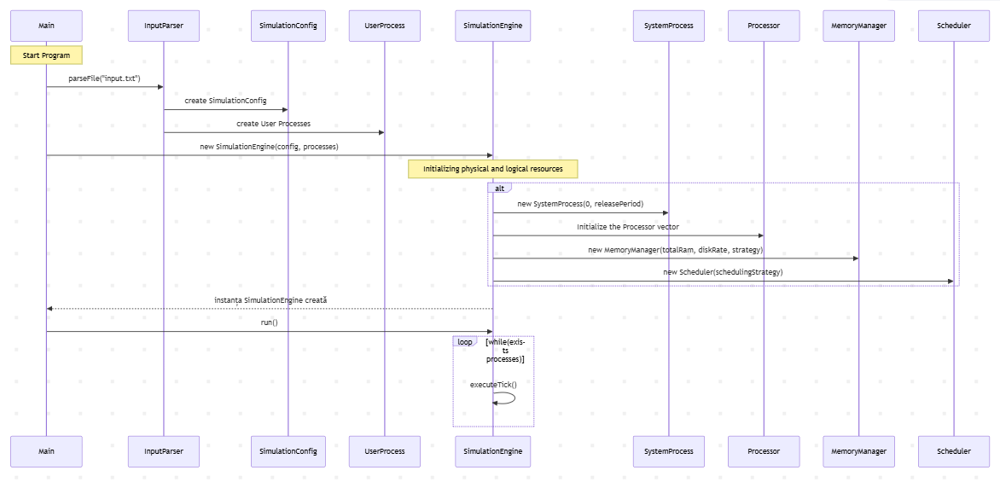
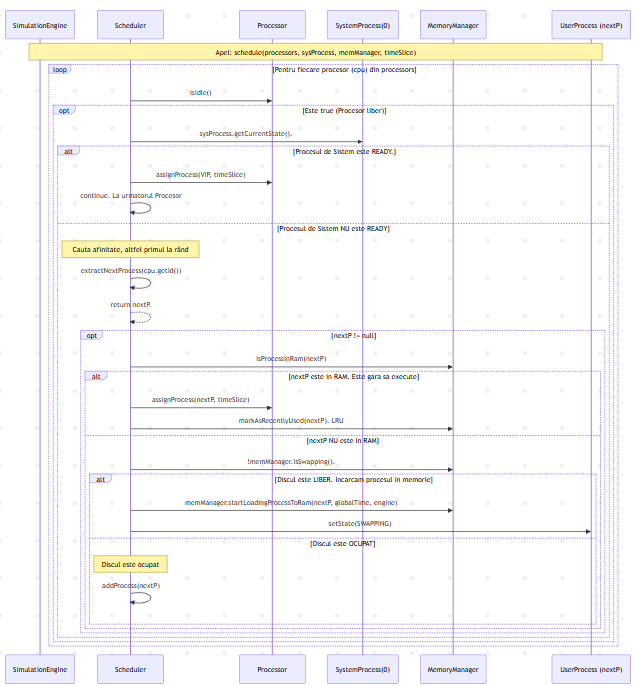
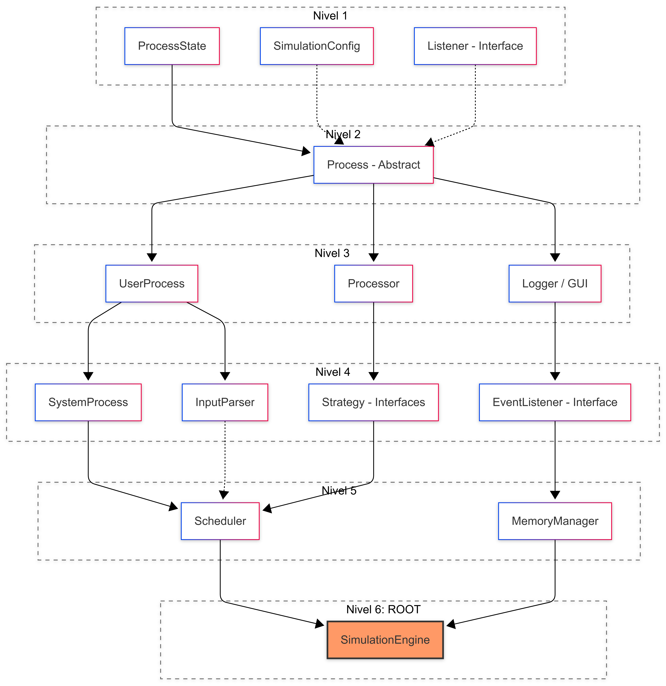

# 🖥️ OS Simulator: Process Scheduling & Virtual Memory Management

A low-level micro-architectural simulator modeling a multiprocessor environment with predictive CPU scheduling and resource-constrained virtual memory swapping.

[](https://events.development-book.com)
[]()
[]()
[]()
[]()

---

## 📖 1. Introduction & Core Requirements
The objective of this project is to design and implement a low-level simulator for the fundamental components of an Operating System: the **Process Scheduler** and the **Virtual Memory Manager**. The simulation strictly models the following complex computing behaviors:

* **Multiprocessor Execution:** Simultaneous operations tracked across a variable array of execution CPUs.
* **Preemptive Round-Robin with Processor Affinity:** Processes are allocated finite time slices ($Time\ Slice$). When resources become free, priority is granted to processes that most recently executed on that specific CPU, respecting cache affinity profiles and reducing context-switching overhead.
* **Virtual Memory System (LRU Policy):** Simulates strict physical RAM constraints through page-replacement routines powered by a **Least Recently Used (LRU)** algorithm.
* **High-Priority System Process (VIP):** A dedicated, zero-memory persistent agent spawned periodically to clear a circular queue of blocked user I/O system calls.

---

## 🏗️ 2. Architectural Design Patterns
To achieve absolute separation of concerns and maintain a modular decoupling loop, the core infrastructure enforces three major architectural patterns:

1. **Model-View-Controller (MVC):** The simulation engine's data mutations and business domains are strictly isolated from character-by-character text parsers and graphical views.
2. **Strategy Pattern:** Enforced via `SchedulingStrategy` and `MemoryReplacementStrategy` interfaces. This allows seamless switching of low-level algorithms without rewriting the central simulation runtime clock.
3. **Observer Pattern:** The central `SimulationEngine` operates as the observable subject. It pushes execution metrics downstream to telemetry listeners (`Logger`, `GanttChartGUI`) via a decoupled `SimulationEventListener` interface.

---

## 🛠️ 3. Modular Core Components

### A. The Simulation Engine (`SimulationEngine`)
Acts as the monolithic system clock driver. Running an infinite ticker sequence, it coordinates the entire hardware stack step-by-step during each loop tick:
1. Evaluates incoming process pools and spawns processes matching the current `globalTime`.
2. Steps the execution counter of the active hardware Disk controller if background memory swapping tasks are marked busy.
3. Wakes up the specialized `SystemProcess` if its microsecond periodic interval has expired.
4. Decrements remaining execution bounds on active CPU nodes and issues software preemption triggers through the `Scheduler`.

### B. The Scheduler (`Scheduler`)
Implements the predictive Round-Robin algorithm. Per project constraints, **no standard library collections were used**; the queue is managed via a manually coded native array circular buffer.
* **Affinity Extraction:** Scans the circular layout to isolate processes whose `lastProcessorId` matches the currently idling CPU slot.
* **VIP Preemption:** Bypasses standard queue iterations. If the `SystemProcess` alerts a ready state, it immediately preempts CPU nodes to execute system routines.

### C. Virtual Memory Manager (`MemoryManager`)
Simulates rigid physical RAM ceilings and background Disk-to-RAM storage mutations.
* **LRU Pipeline:** Handled via a shift-on-access native array. Ticking a process fires `markAsRecentlyUsed()`, moving it to the end index (MRU slot) and pushing stale memory regions to index `0` for imminent eviction.
* **Swapping Math:** The time penalty required to load a process footprint into volatile RAM pages is derived explicitly using:
  $$\text{Swap Ticks} = \left\lceil \frac{\text{Required Memory}}{\text{Disk Transfer Rate}} \right\rceil$$

### D. The System Process (`SystemProcess`)
Resides permanently in memory with a $0\text{-byte}$ footprint. It wakes up on strict mathematical periods to clear I/O delays accumulated inside an independent circular blocking stack. It yields its processor allocations and falls back to sleep immediately when its local request queue returns empty.

### E. Input Parser (`InputParser`)
An optimized, character-by-character ASCII reader that completely bypasses Java's standard string tokenizers or split utilities. It manually assembles data bits while discarding extraneous whitespace configurations, tabs, and invalid sequences safely.

---

## 🔄 4. Process State Machine
Every task pool transaction scales through a highly deterministic state sequence:

| Process State | Description for **User Processes** | Description for the **System Process** |
|:---|:---|:---|
| **`NEW`** | Parsed from configuration; waits until the clock hits `releaseTime`. | *N/A* (Initialized permanently in memory). |
| **`SWAPPING`** | Selected by the scheduler, but blocked waiting for Disk page transfers. | *N/A* (Resides permanently in volatile memory layers). |
| **`READY`** | Fully paged inside RAM; waits in the ready circular array for an open CPU node. | Awakened by the periodic timer; instantly waits to preempt a CPU. |
| **`RUNNING`** | Active on a processor; decrements its execution burst block per clock tick. | Clear system calls and services user process I/O blocks. |
| **`WAITING_IO`**| Suspended from CPU execution; queued up inside the dedicated I/O buffer. | Local request queue is empty; falls into a sleep state to free up CPU slots. |
| **`TERMINATED`**| All execution steps are completed; flushed from tables permanently. | *N/A* (Runs continuously until the simulation engine terminates). |

---

## 📊 5. Interaction Diagrams
The sequence models below trace structural component relationships during runtime loops:

### Application Initialization Flow
Tracks file ingestion parsing, hardware instantiation bounds, strategy configuration bindings, and telemetry observer attachments.


### Scheduler Execution Micro-Step Flow
Maps clock ticks, handling high-priority VIP task routing, affinity searching loops, and RAM page eviction workflows.


---

## 🛡️ 6. Design by Contract (Assertions)
In parallel with traditional integration architectures, the code implements native runtime verification through Java `assert` clauses to guarantee the structural integrity of manual layouts:

* **Preconditions:** Enforces data safety limits before a block executes (e.g., `assert process != null : "Cannot assign a null process to CPU"`; `assert timeSlice > 0 : "Time slice quantum must be greater than 0"`).
* **Postconditions:** Verifies state trends match logic expectations exactly following mutation routines (e.g., `assert globalTime == previousTime + 1 : "Simulation clock failed to step forward monotonically"`).
* **Class Invariants:** Automated verification helpers (`checkQueueInvariant()` and `checkMemoryInvariant()`) evaluate array boundaries, index calculations, and RAM usage constraints before and after any modification routine.

---

## 🧪 7. Test Strategy & Coverage Metrics
The verification framework leverages an **Incremental Bottom-Up Testing** methodology managed with **Mockito** to isolate logic blocks from underlying cascading faults.



The system achieves near-perfect branch testing across the entire execution stack:
* **Boundary Safeguards:** Validated against capacity overflows (e.g., flooding over 1,000 active blocks into the manual buffer).
* **Defensive Error Resilience:** Handled empty RAM evictions, missing/invalid file pathways, and negative task bursts without crashing.

---

## 🚀 8. Running the Simulator

1. Ensure a valid compiled **Java Development Kit (JDK) 8 or higher** is configured in your environment path.
2. Place your system config constraints file exactly named `input.txt` inside the root workspace folder.
3. The configuration format must map space-delimited numerical values:
   ```text
   [Processors_Count] [Total_RAM] [Time_Slice_Quantum] [System_Process_Period] [Disk_Rate]
   [Release_Time] [RAM_Required] [CPU_Burst_1] [IO_Burst_1] [CPU_Burst_2] ...

---

## ⚠️ 9. Technical Note: Thrashing Behavior

The architecture purposefully lacks an integrated Thrashing mitigation layer. If the aggregate working footprints of your active process configuration outscale your total physical RAM pool, the system will drop into a Thrashing loop—spending nearly $100\%$ of its CPU runtime cycles moving pages back and forth via Swapping Disk transactions rather than executing active compute sequences.
