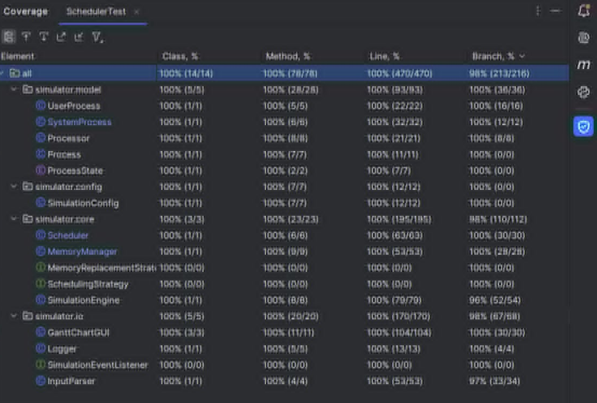

# Software Testing & Quality Assurance Documentation

## 1. Overview
This document outlines the testing strategy, execution, and coverage metrics for the OS Simulator project. The goal of the testing phase was to ensure the robustness, correctness, and fault-tolerance of the core components (Scheduler, Memory Manager, CPU processing, and I/O handling).

The testing relies heavily on **Unit Testing** combined with an **Incremental Bottom-Up** integration strategy. The focus was not just on verifying the "happy path," but also on ensuring that the system gracefully handles incorrect input data, capacity overflows, and edge cases without fatal crashes.

## 2. Testing Strategy

### 2.1. Bottom-Up Incremental Testing
The testing process was designed following a strict Bottom-Up hierarchy. We first tested the independent foundational modules (configurations, states). Once verified, these modules were trusted and used to test higher-level execution entities (processes, processors), eventually culminating in the testing of the highly complex algorithmic modules (Scheduler, Memory Manager) and the central `SimulationEngine`.

### 2.2. Module Isolation & Mocking
To ensure that each module is tested independently, **Mockito** was used extensively. By injecting mock objects (e.g., mocking the `MemoryManager` when testing the `Scheduler`), we isolated the logic of the specific class under test. This prevents failures in lower-level components from cascading and causing false negatives in higher-level tests.

### 2.3. Dependency Architecture
The following diagram illustrates the Bottom-Up dependency tree used to dictate the order of test execution:

*(Note: The diagram illustrates how Level 1 components are tested first, moving up layer by layer until reaching the Level 6 `SimulationEngine`.)*

---

## 3. Test Coverage & Execution Results

The test suite provides near-complete code coverage across the entire project. Below is the snapshot of the generated coverage report:

While the vast majority of classes achieved **100% Line and Branch Coverage**, minor deviations exist in specific UI and integration components. This is expected and standard in software testing, as detailed in the module breakdown below.

---

## 4. Detailed Module Test Breakdown

### Level 1 & 2: Foundations & Models
* **`SimulationConfigTest.java` (100% Coverage)**
    * **What was tested:** Verifies the correct instantiation of immutable system parameters (RAM, CPU count, Time Slice). Tests the `toString()` method for correct formatting.
* **`ProcessState` & `SimulationEventListener`**
    * Enums and interfaces inherently hold no logic and act as contracts, requiring no explicit unit tests.

### Level 3: Execution Entities
* **`ProcessorTest.java` (100% Coverage)**
    * **What was tested:** CPU initialization, assigning processes (affinity tracking), and eviction logic. Evaluates the `executeTick()` method to ensure the time slice decrements correctly.
    * **Fault Tolerance:** Tests assigning a `null` process to ensure the CPU handles empty states without throwing `NullPointerExceptions`.
* **`UserProcessTest.java` (100% Coverage)**
    * **What was tested:** Alternating states between CPU bursts and I/O blocking.
    * **Incorrect Input Handling:** Tests sequences that are `null`, empty, or contain negative burst values. The logic successfully transitions the process to a `TERMINATED` state or switches to I/O immediately, preventing infinite loops.

### Level 4: Services & Input/Output
* **`SystemProcessTest.java` (100% Coverage)**
    * **What was tested:** The VIP periodic wakeup trigger (`checkReleaseTime`), servicing I/O bursts for user processes, and transitioning to `WAITING_IO` when idle.
    * **Boundary Limits:** Tests pushing over 1,000 items into the manual circular queue to ensure capacity limits are respected without crashing.
* **`InputParserTest.java` (~97% Branch Coverage)**
    * **What was tested:** Manual, character-by-character string parsing (bypassing standard library split functions).
    * **Incorrect Input Handling:** Tests irregular spacing, tabs, and non-numeric characters. It also tests providing a non-existent file path, ensuring the `IOException` is caught and handled safely internally.
    * *Coverage Note:* The missing 3% on branches corresponds to deep underlying I/O stream exceptions that are heavily dependent on the OS file system and are difficult to safely trigger in a standard unit test.
* **`LoggerTest.java` (100% Coverage)**
    * **What was tested:** File creation, message writing, and stream closure. Includes tests for missing/invalid file paths to ensure the fallback protection (`if writer != null`) works correctly.

### Level 5: Core Algorithms
* **`SchedulerTest.java` (100% Branch Coverage)**
    * **What was tested:** The Round-Robin scheduling logic, process queue management, and the disk swap-in trigger. Tests the VIP priority system (ensuring `SystemProcess` takes the CPU immediately when ready).
    * **Affinity Logic:** Tests the queue iteration to verify that the scheduler successfully searches for and extracts a process that previously ran on the available CPU.
    * **Isolation:** `MemoryManager` and `SimulationEngine` were fully mocked to test CPU assignment purely based on state.
* **`MemoryManagerTest.java` (100% Coverage)**
    * **What was tested:** The manual Least Recently Used (LRU) array shifting logic, RAM capacity calculations, and Swapping tick math (`Math.ceil` behavior).
    * **Edge Cases:** Evicting from an empty RAM, marking a process as MRU when it is already the most recently used, and mathematical edge cases where a process requires 0 memory.

### Level 6: Integration
* **`SimulationEngineTest.java` (~96% Branch Coverage)**
    * **What was tested:** The central clock tick orchestrator. Uses Java Reflection to inject mocked subsystems (Scheduler, CPU, Memory). Tests the interaction flow: Process Launch -> CPU Assign -> Preemption -> RAM Swapping -> I/O Blocking -> VIP Servicing.
    * **Coverage Note:** The slightly less than 100% branch coverage is expected here. The engine contains highly defensive `else` statements guarding against impossible concurrent states (e.g., a process terminating exactly while being swapped in under a specific edge-case tick).
* **`GanttChartGUITest.java` (UI Coverage)**
    * **What was tested:** Tracking blocks of execution for CPUs and the Hard Disk. Simulates a `Graphics2D` context to trigger the `paintComponent` method.
    * **Coverage Note:** UI rendering classes (Java Swing) generally do not reach 100% branch coverage in unit tests because native OS rendering events, font metrics, and window manager callbacks cannot be entirely replicated in a headless testing environment. The logic for block coordinate tracking, however, was fully verified.